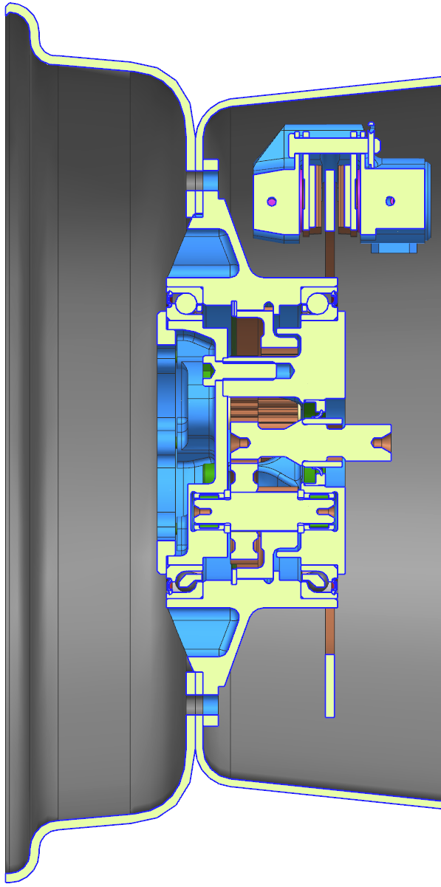
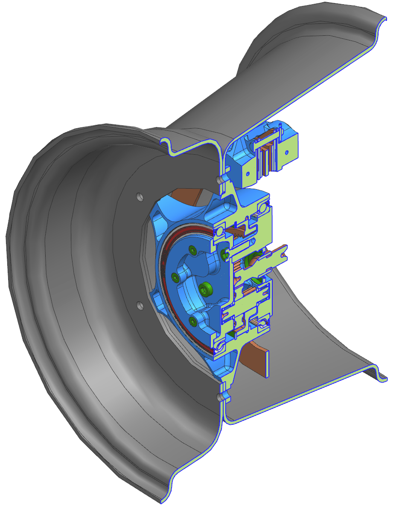

# Two-Staged Planetary Gearbox Design Optimization

Optimization scripts for designing a two-stage compound planetary gearbox for an electric race car. The main challenge was finding tooth combinations that satisfied tight packaging constraints while meeting strength and manufacturing requirements.

<table>
  <tr>
    <td width="33%"></td>
    <td width="33%"></td>
    <td width="33%"></td>
  </tr>
  <tr>
    <td align="center"><i>Assembly Animation</i></td>
    <td align="center"><i>Section View</i></td>
    <td align="center"><i>Isometric View</i></td>
  </tr>
</table>

## Background

This gearbox was designed and manufactured for a high-performance electric race car. Requirements were:

- Gear ratio: ~12:1
- Max diameter: 110mm (in-wheel mount for aerodynamic benefit)
- Input: 29Nm @ 20,000 rpm
- Output: ~300Nm @ 1700 rpm
- Service life: 1000km racing conditions
- Weight target: <2kg

## Design Configuration

**Type:** 1.5-stage compound planetary

- 3 planets at 120° spacing
- Both planet gears mounted on same shaft (compound configuration)
- Input: sun gear, Output: ring gear
- Target ratio: 12.2:1 ±2%

**Why compound planetary:**

Standard two-stage configurations where stages are arranged separately required too much axial or radial space. The compound design (both planet gears on shared shafts) allows both stages to occupy the same radial envelope, significantly reducing the outer diameter.

Additional benefits:

- Coaxial input/output (direct mounting to motor and wheel hub)
- Fewer active gear meshes compared to conventional arrangements (efficiency ~96% vs ~95%)
- Meets weight and strength requirements

Tradeoff: compound planets require more complex manufacturing (crowned spline shaft between the two planet gears), but this was acceptable given the packaging constraints.

## Optimization Approach

The main script uses exhaustive search through the discrete design space:

```matlab
FOR each module combination (0.8-1.25mm)
  FOR each tooth count combination (z_sun, z_planet1, z_planet2, z_ring)
    FOR each pressure angle (20°)
      Calculate gear ratio
      IF ratio ≈ 12.2:1:
        FOR each center distance (0.2mm increments):
          Calculate profile shifts
          Calculate full involute geometry
          Check all constraints
          IF valid: Store combination
```

Runtime: ~2-5 minutes. Typical output: 50-200 valid combinations from ~100k tested.

**Why exhaustive search:**

The design space has characteristics that make gradient-based optimization problematic:

- Tooth counts must be integers (discrete variables)
- Modules limited to standard series (DIN 780)
- Multiple non-smooth constraints (assembly conditions, coprime requirements, collision checks)
- Non-convex feasible region

Exhaustive search guarantees finding all viable solutions in the design space.

**Geometry calculations:**

For each tooth combination, the script calculates complete involute gear geometry:

- Operating pressure angles from center distance
- Profile shift coefficients from involute function
- Pitch, addendum, and dedendum diameters
- Tooth thickness at all relevant diameters
- Contact ratios and interference checks

## Constraints

**Kinematic constraints:**

- Gear ratio: `i = (z_p1/z_s) × (-z_h/z_p2) = 12.2 ±2%`
- Assembly condition: `(z_s×z_p2 + z_p1×z_h) / (3×gcd(z_p1,z_p2))` must be integer
  - Ensures planets can be assembled at 120° spacing without gear tooth interference
- Coprime tooth counts: gcd(z_s, z_p1)=1 and gcd(z_p2, z_h)=1
  - Required for uniform wear distribution across all teeth

**Geometric constraints:**

- Center distance matching: Both stages must have similar center distances (±2mm tolerance) since planet gears share a common shaft
- Profile shift ranges:
  - Stage 1: sum = 0.8-1.0 (high positive shift for increased tooth root strength on high-speed stage)
  - Stage 2: sum = -0.8-0.8 (broader range acceptable for lower speed stage)
  - Calculated from operating pressure angles and center distances
- Planet collision avoidance: `d_addendum,planet < 2×a×cos(30°)` for 120° spacing
- Minimum contact ratio: ε ≥ 1.20

**Stress balance:**

- Stress ratio between stages: σ = `(z_p2/z_p1) × |(z_s+z_p1)/(z_h-z_p2)|³ ≥ 0.5`
- Prevents designs where one stage is significantly weaker than the other

**Manufacturing and integration constraints:**

- Sun shaft diameter: 8mm ≤ d_f,sun (shaft strength) and d_a,sun ≤ 17mm (seal clearance)
- Planet shaft diameter: d_f,planet ≥ 8mm (HK0810 needle bearing inner diameter)
- Ring gear wall thickness: ≥3mm under tooth root (case hardening requirements)
- Planet carrier bolt clearance: 6mm bolts must fit between planet gears at 120° spacing
- Maximum outer diameter: 110mm

## Workflow

### 1. Load spectrum generation

`scripts/01_create_loads.m` - Bins race telemetry data (torque/speed) into histogram

`scripts/02_create_load_spectrum.m` - Converts histogram to normalized load spectrum for fatigue analysis

### 2. Tooth optimization

`scripts/03_tooth_optimization.m` - Main optimization script

- Input: Design requirements and constraints
- Output: Matrix of valid tooth combinations [N × 19 columns]
- Each row contains: ratios, center distances, modules, tooth counts, profile shifts, stress ratio, dimensions

### 3. Detailed analysis (external)

Export candidate designs to gear analysis software (KISSsoft) for:

- ISO 6336:2019 strength calculations with load spectrum
- Bearing life calculations
- Efficiency calculations with friction models
- Final safety factor verification

### 4. Design selection

`scripts/04_design_selection.m` - Reads detailed analysis results and ranks combinations based on safety factors and efficiency

## Output Data

Main script outputs a matrix where each row represents one valid design:

| Columns | Parameter | Description |
|---------|-----------|-------------|
| 1-3 | i, i₁, i₂ | Total ratio and stage ratios |
| 4-5 | a_min, a_max | Center distance range (manufacturing tolerance) |
| 6-7 | m₁, m₂ | Module sizes (mm) |
| 8 | α | Pressure angle |
| 9-12 | z_s, z_p1, z_p2, z_h | Tooth counts |
| 13-16 | x ranges | Profile shift coefficient ranges |
| 17 | σ | Stress balance ratio |
| 18-19 | d_outer | Outer diameter estimates |

## Implementation Details

**Materials:**

- Gears: 18CrNiMo7-6 case-hardened steel, profile ground to IT3 quality
- Lubrication: Splash lubrication, ISO VG 220 oil
- Target safety factors: SF_bending = 1.2, SF_contact = 0.9

**Electric vehicle considerations:**

Electric race cars use significant regenerative braking, which creates bidirectional torque loading on the gearbox. This results in fully reversed bending stress (stress ratio R ≈ -1.2), unlike conventional combustion engine gearboxes that primarily see unidirectional loading.

For case-hardened steel under alternating stress, the endurance limit modifier (Y_M) is approximately 0.7 compared to 1.0 for unidirectional loading. This represents about 30% reduction in fatigue strength and must be accounted for in the tooth root stress calculations.

Design approach:

- Higher profile shift sums (0.8-1.0) to increase tooth root thickness
- Tight manufacturing tolerances (IT3) to reduce stress concentration
- Load spectrum derived from actual race telemetry data

**Final design:**

The optimization identified ~150 geometrically valid tooth combinations. After detailed strength analysis, the selected design achieved:

- 108mm outer diameter
- 1.6kg mass
- 96% efficiency (including seals)
- 37mL oil volume

## Notes

Standard gear design tools typically assume tooth counts are already selected and focus on verification (strength, efficiency, etc.). This approach is effective when packaging space is not limiting.

In packaging-constrained applications, the primary challenge is finding tooth combinations that satisfy geometric and kinematic requirements. Many otherwise viable designs fail due to bearing clearances, assembly interference, or dimensional limits.

This script addresses that by systematically identifying all geometrically feasible solutions first, which can then be evaluated for strength and performance using detailed analysis tools.

For this project, the exhaustive search was necessary to achieve the in-wheel mount configuration within the specified diameter constraint.

---

- Previous design work for electric race car gearbox development*
